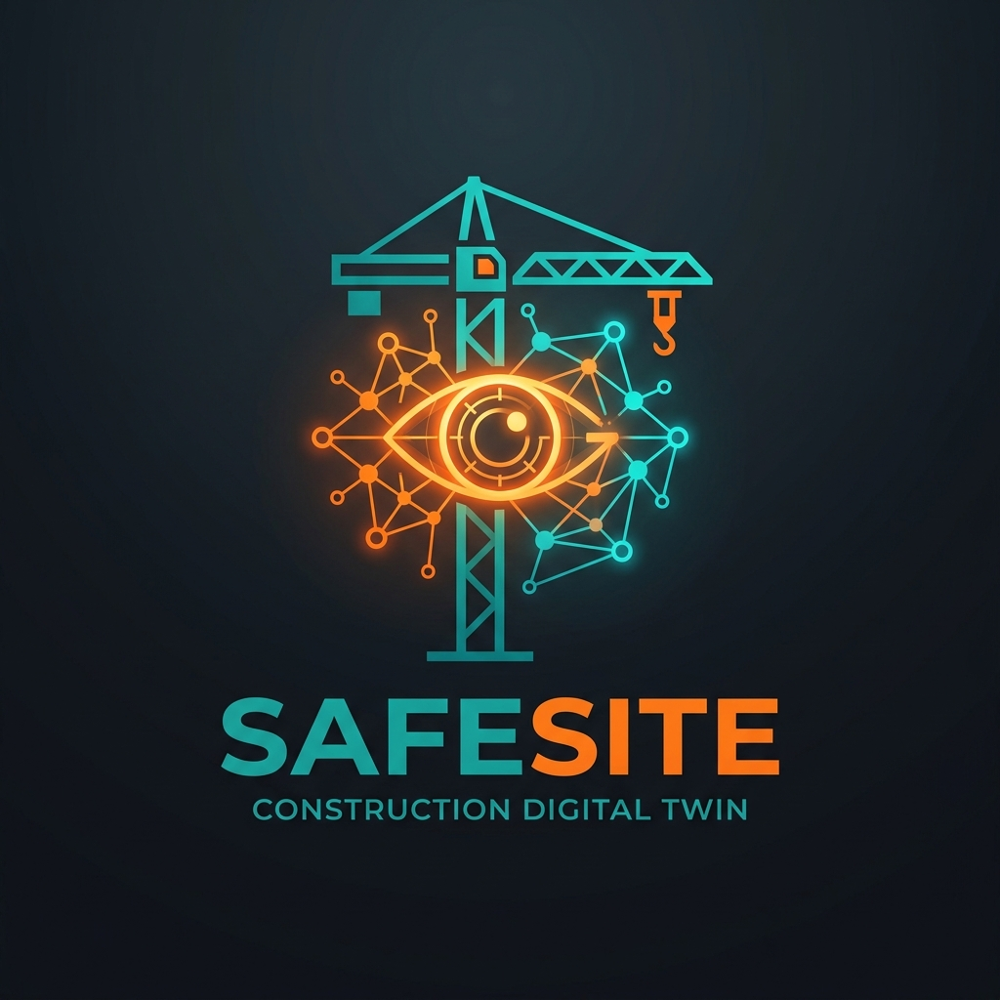
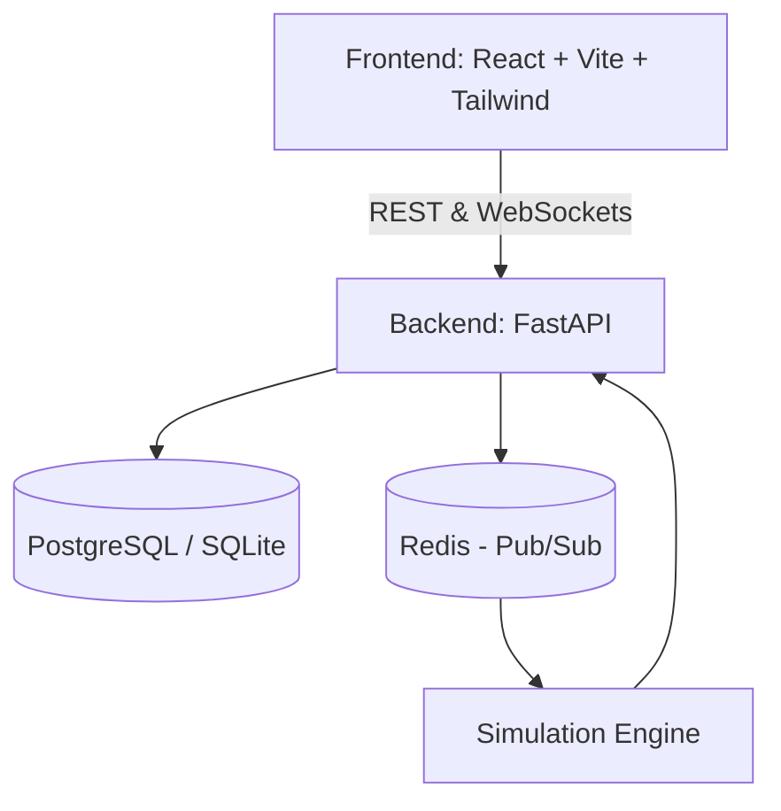

<div align="center">
  
  <h1>SafeSite — Construction Digital Twin</h1>
  <p>Real-time construction site safety intelligence platform with predictive analytics and smart hazard detection.</p>

  [](http://13.60.57.168:4005)
  [](https://reactjs.org/)
  [](https://fastapi.tiangolo.com/)
  [](https://www.docker.com/)

</div>

---

## 🚀 Live Demo

**Access the live application here:** [http://13.60.57.168:4005](http://13.60.57.168:4005)
- **Email:** `admin@site.local`
- **Password:** `admin12345`

---

## 🌟 Overview

**SafeSite** is a next-generation safety intelligence platform designed for modern construction sites. By blending the physical and digital worlds into a **Digital Twin**, site managers can visualize worker locations, track heavy machinery, and receive instant alerts when safety parameters are breached.

From real-time fatigue monitoring to predictive hazard collision detection, SafeSite is engineered to eliminate accidents before they happen.

## ✨ Key Features

- **🌐 Live 2D/3D Digital Twin Map:** Visualize the entire construction site in real-time, displaying exact worker positions and machinery operations.
- **❤️ Worker Fatigue Monitoring:** Keep track of biometrics and receive predictive warnings if a worker exceeds safe fatigue thresholds.
- **🚧 Dynamic Hazard Zones:** Create dynamic geofences for crane operations, deep excavations, and overhead lifts. Instant alerts are fired for zone violations.
- **🔬 Advanced Simulation Engine:** Run high-speed hypothetical scenarios to find weak points in your safety protocols without putting real lives at risk.
- **📊 Real-time Analytics Dashboard:** High-level metrics for safety scores, active risks, average crew heart rates, and incident reports.

---

## 🏗️ Architecture



---

## 🛠️ Technology Stack

- **Frontend:** React, TypeScript, Tailwind CSS, Vite, Lucide Icons, Framer Motion
- **Backend:** FastAPI, Python, SQLAlchemy, Uvicorn
- **Data & Caching:** PostgreSQL (or SQLite local fallback), Redis
- **Deployment:** Multi-stage Docker, CloudPilot integration

---

## 💻 Local Setup (Development)

### Prerequisites
- [Node.js](https://nodejs.org/en/) (v20+)
- [Python](https://www.python.org/downloads/) (v3.11+)
- [Docker](https://www.docker.com/) (optional, for full-stack build)

### 1. Frontend Setup
```bash
# Install dependencies
npm install

# Start the Vite development server
npm run dev
```

### 2. Backend Setup
```bash
cd backend

# Install python dependencies
pip install -r requirements.txt

# Start the FastAPI server (with auto-reload)
uvicorn app.main:app --reload
```

---

## 🐳 Docker Deployment (One-Click)

This project features a fully containerized **multi-stage build** for seamless deployment. The entire stack (React static files + FastAPI server + SQLite database) is packaged into a single lightweight Docker container.

```bash
# Build the image
docker build -t safesite-digital-twin .

# Run the application
docker run -p 8080:80 safesite-digital-twin
```

Then visit `http://localhost:8080` in your browser.

---

## 📄 License
This project is licensed under the MIT License. See the [LICENSE](LICENSE) file for details.
